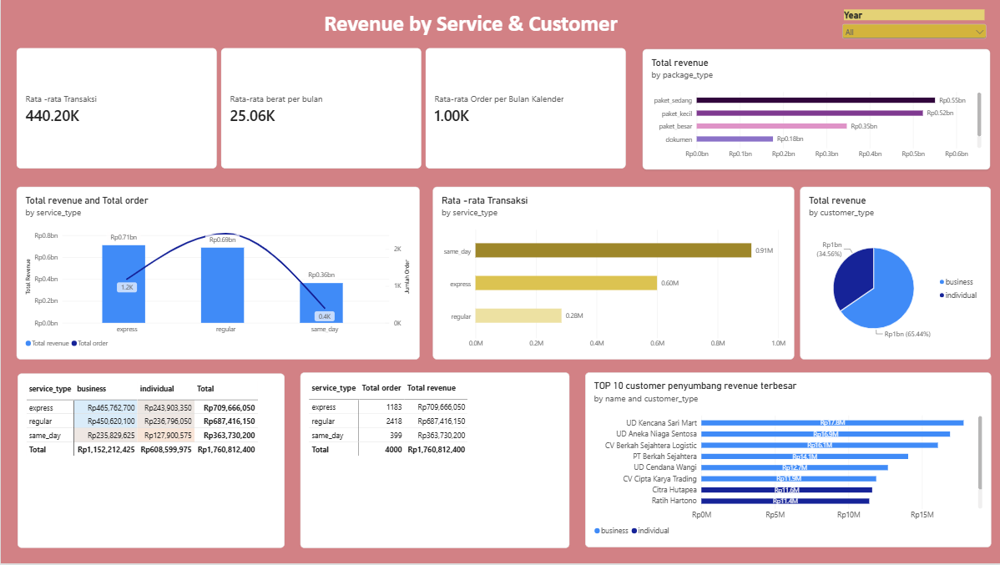

# 📦 Kirimlaju Logistics Performance Analysis

**Analisis performa operasional & bisnis perusahaan logistik "Kirimlaju"** menggunakan Power BI — mengubah 4.000 baris data shipment mentah menjadi rekomendasi bisnis yang bisa langsung dieksekusi oleh tim Ops, Sales, Pricing, dan Planning.

> 🔎 **Highlight temuan:** Dashboard awal menunjukkan on-time rate cuma **52,97%** (bahkan layanan Same Day tercatat 0%). Setelah diaudit, ternyata itu bug formula tanggal — angka sebenarnya **79,75%**. Cerita lengkapnya ada di Babak 3.

---

## 🧰 Tools & Dataset

- **Tools:** Power BI Desktop (Power Query untuk data prep, DAX untuk measures)
- **Dataset:** 4.000 shipment record, 600 customer, 80 rute, ±16.700 event status history
- **Periode data:** Januari 2022 – Januari 2025
- **File:** [`project data analyst logistic leo.pbix`](./project%20data%20analyst%20logistic%20leo.pbix) | [`kirimlaju/`](./kirimlaju) (dataset mentah)

---

## 📖 Daftar Isi

1. [Overview Summary — Seberapa Besar Bisnis Kita?](#babak-1-overview-summary--seberapa-besar-bisnis-kita)
2. [Revenue by Service & Customer — Yang Ramai Belum Tentu Yang Cuan](#babak-2-revenue-by-service--customer--yang-ramai-belum-tentu-yang-cuan)
3. [Operasional & SLA — Titik Balik Cerita Ini](#babak-3-operasional--sla--titik-balik-cerita-ini)
4. [Efisiensi Rute — Rute Mana yang Benar-Benar Efisien?](#babak-4-efisiensi-rute--rute-mana-yang-benar-benar-efisien)
5. [Risiko & Kualitas — Dua Risiko yang Levelnya Beda Jauh](#babak-5-risiko--kualitas--dua-risiko-yang-levelnya-beda-jauh)
6. [Musim & Kapasitas — Kapan Harus Siap-Siap Nambah Armada?](#babak-6-musim--kapasitas--kapan-harus-siap-siap-nambah-armada)
7. [Rekomendasi Gabungan](#-rekomendasi-gabungan)

---

## Babak 1: Overview Summary — Seberapa Besar Bisnis Kita?

### 🎯 Pertanyaan Bisnis
Sebelum bicara efisiensi atau risiko, tim manajemen perlu tahu dulu: seberapa besar sebenarnya operasi Kirimlaju ini?

### 🔍 Temuan
Dari Januari 2022 sampai Januari 2025, Kirimlaju sudah memproses **4.000 kiriman**, menghasilkan **Rp 1.760.812.400** revenue, mengangkut **100.243,7 kg** barang, dan melayani **598 dari 600 pelanggan terdaftar** (2 pelanggan belum pernah kirim sama sekali). Jakarta adalah pusat gravitasi bisnis ini — **945 kiriman (23,6%)** berasal dari sana.

| KPI | Nilai |
|---|---|
| Total Shipment | 4.000 |
| Total Revenue | Rp 1.760.812.400 |
| Total Berat Terangkut | 100.243,7 kg |
| Jumlah Pelanggan Aktif | 598 / 600 |
| Kota Asal Terbesar | Jakarta (945 kiriman) |

Sheet ini sengaja tidak membahas ketepatan waktu atau risiko — itu baru dijawab di babak-babak berikutnya.

### ✅ Rekomendasi
Jadikan angka-angka ini baseline resmi tim untuk evaluasi bulanan, supaya semua pihak mulai dari titik yang sama sebelum masuk ke detail per layanan atau per rute.

---

## Babak 2: Revenue by Service & Customer — Yang Ramai Belum Tentu Yang Cuan

### 🎯 Pertanyaan Bisnis
Tim ops Kirimlaju mau tahu layanan mana yang paling laku dan nyumbang revenue paling besar, biar keputusan kapasitas armada nggak asal tebak. Tim sales juga ingin tahu: fokus akuisisi ke klien korporat atau ritel?

### 🔍 Temuan

| Layanan | Jumlah Shipment | % Volume | Revenue | % Revenue | Avg Cost/Kiriman |
|---|---|---|---|---|---|
| Regular | 2.418 | 60,5% | Rp 687.416.150 | 39,0% | Rp 284.291 |
| Express | 1.183 | 29,6% | Rp 709.666.050 | **40,3%** | Rp 599.887 |
| Same Day | 399 | 10,0% | Rp 363.730.200 | 20,7% | **Rp 911.605** |

Regular paling laku (60% volume) tapi bukan paling cuan — Express yang volumenya cuma separuh Regular justru penyumbang revenue terbesar.

| Segmen | Shipment | Revenue | % Revenue | Jml Customer | % Customer | AOV |
|---|---|---|---|---|---|---|
| Business | 2.611 | Rp 1.152.212.425 | 65,4% | 399 | 66,7% | Rp 441.292 |
| Individual | 1.389 | Rp 608.599.975 | 34,6% | 199 | 33,3% | Rp 438.157 |

Business menyumbang 65% revenue, tapi itu nyaris identik dengan porsi jumlah pelanggannya (67%) — bukan karena mereka belanja lebih royal per orang. Nilai transaksi rata-rata Business dan Individual nyaris kembar.

### ✅ Rekomendasi
Prioritaskan kapasitas & SLA ke **Express** (mesin pencetak revenue), bukan proporsional ke jumlah order. Untuk sales, jangan asumsikan otomatis Business lebih bernilai per kepala — datanya tidak mendukung itu.

---

## Babak 3: Operasional & SLA — Titik Balik Cerita Ini

### 🎯 Pertanyaan Bisnis
Customer sering komplain paket telat. Ops Manager butuh angka on-time rate yang jujur per layanan — bukan angka yang sudah dipoles.

### 🔍 Temuan
Dashboard menampilkan **SLA Success Rate 52,97%**, dan begitu dipecah per layanan: Regular 61,17%, Express 54,85%, **Same Day 0%**. Angka nol inilah yang memicu audit lebih dalam — tidak masuk akal semua 333 kiriman Same Day tanpa kecuali gagal tepat waktu.

Setelah ditelusuri, ditemukan dua lapis bug:
1. Formula pengecekan tepat-waktu membandingkan **jam-menit-detik** pengiriman dengan target yang otomatis dianggap "tengah malam" — jadi kiriman Same Day yang wajar sampai sore/malam di hari yang sama selalu tercatat "telat".
2. Kolom tanggal pengiriman aktual yang biasa dipakai ternyata **salah geser 1+ hari dari catatan waktu aslinya di 94,5% baris data**.

Setelah dihitung ulang pakai catatan waktu yang benar:

| Layanan | Angka di Dashboard (bug) | Angka Sebenarnya |
|---|---|---|
| Regular | 61,17% | **82,31%** |
| Express | 54,85% | **77,69%** |
| Same Day | 0% | **70,57%** |
| **Overall** | **52,97%** | **79,75%** |

**1.084 dari 3.150 kiriman (34,4%)** yang tadinya dianggap "telat" ternyata sebenarnya tepat waktu.

### ✅ Rekomendasi
**Prioritas #1 dari seluruh analisis ini.** Perbaiki kolom dan formula perhitungan tanggal pengiriman sebelum dashboard ini dipakai untuk evaluasi kontrak SLA atau menilai kinerja tim ops. Kabar baiknya: performa asli Kirimlaju jauh lebih sehat (80% on-time) dari yang terlihat di layar.

---

## Babak 4: Efisiensi Rute — Rute Mana yang Benar-Benar Efisien?

### 🎯 Pertanyaan Bisnis
Manajemen mau tahu rute mana yang jadi tulang punggung revenue dan mana yang paling efisien, biar prioritas armada dan tarif diarahkan ke situ.

### 🔍 Temuan

| Rute Revenue/KM Tertinggi | Rp/km | Rute Revenue/KM Terendah | Rp/km |
|---|---|---|---|
| Jakarta–Bekasi | 10.310 | Semarang–Medan | 312 |
| Jakarta–Tangerang | 9.546 | Surabaya–Manado | 320 |
| Jakarta–Bogor | 4.501 | Jakarta–Manado | 338 |

| Kategori Jarak | Jml Rute | Total Revenue | AOV | Revenue/Rute |
|---|---|---|---|---|
| Pendek (≤150km) | 13 | Rp 179,5jt | Rp 277.851 | Rp 13,8jt |
| Menengah (150–400km) | 11 | Rp 194,8jt | Rp 346.006 | Rp 17,7jt |
| Jauh (>400km) | 56 | Rp 1.386,6jt | Rp 495.689 | Rp 24,8jt |

Korelasi jarak dengan **nilai transaksi sangat kuat** (r=0,92), tapi korelasi jarak dengan **frekuensi order nyaris nol** (r=-0,02). Rute jauh menang secara revenue absolut bukan karena lebih sering dipesan, tapi karena tarifnya lebih mahal. Namun secara **efisiensi per kilometer, rute jauh justru paling rendah** — rute Jabodetabek 30x lebih efisien dibanding rute lintas pulau ke Sumatra/Sulawesi.

### ✅ Rekomendasi
Investasi armada tambahan diarahkan ke rute jarak jauh (kontribusi revenue terbesar), tapi tim pricing perlu meninjau ulang tarif per-km di rute-rute lintas pulau (Medan, Manado, Makassar) — bukan karena rugi, tapi karena marginnya paling tipis dibanding potensi jaraknya.

---

## Babak 5: Risiko & Kualitas — Dua Risiko yang Levelnya Beda Jauh

### 🎯 Pertanyaan Bisnis
Head of Ops khawatir soal reputasi (persentase paket lost/returned), dan tim pricing curiga label `package_type` sering asal diisi kurir sehingga tarif jadi salah.

### 🔍 Temuan

**Risiko pengiriman** — stabil dan wajar:

| Status | % |
|---|---|
| Delivered | 80,0% |
| In Transit | 12,5% |
| Returned | 5,0% |
| Lost | 2,5% |
| **Problem Rate (Lost+Returned)** | **7,5%** |

Problem rate per jenis paket cukup merata (6,8%–9,2%) — hipotesis "fragile lebih sering hilang" **tidak terbukti**; justru Dokumen yang tertinggi (9,18%).

**Risiko mislabel** — jauh lebih serius:

| Package Type | Rata-rata Berat | Kandidat Mislabel |
|---|---|---|
| Dokumen | 24,3 kg (harusnya <1kg) | **92,0%** dari kategori ini |
| Paket Kecil | 25,6 kg | **82,3%** dari kategori ini |
| Fragile / Sedang / Besar | 24–26 kg | *(belum ada aturan deteksi)* |

Total **1.350 dari 4.000 kiriman (33,75%)** adalah kandidat salah label — potensi kebocoran tarif yang nyata, bukan sekadar masalah kerapian data.

### ✅ Rekomendasi
Audit gudang prioritas ke kategori **Dokumen** dulu (potensi kerugian per transaksi paling besar), lalu **Paket Kecil**. Jangka menengah, ganti input `package_type` manual dengan kalkulasi otomatis dari berat aktual timbangan.

---

## Babak 6: Musim & Kapasitas — Kapan Harus Siap-Siap Nambah Armada?

### 🎯 Pertanyaan Bisnis
Tim planning mau siapkan armada tambahan sebelum musim ramai, tapi kapan tepatnya volume naik? Feeling saja tidak cukup.

### 🔍 Temuan
Pola konsisten 3 tahun berturut-turut: **Januari & Agustus** selalu jadi bulan puncak (rata-rata 116 kiriman/bulan), **November** justru paling sepi (92,3) — bukan Desember/Harbolnas seperti asumsi umum soal akhir tahun.

| Tahun | Volume | Revenue |
|---|---|---|
| 2022 | 1.335 | Rp 580,6jt |
| 2023 | 1.270 | Rp 560,1jt |
| 2024 | 1.271 | Rp 563,7jt |
| 2025 (baru Jan) | 124 | Rp 56,5jt |

Rata-rata pertumbuhan YoY di semua bulan yang punya pembanding mendekati **0%** (flat), dengan volatilitas bulanan tinggi (-25% s.d +31%). Satu-satunya sinyal positif nyata: Januari 2025 tumbuh **+10,7%** volume dibanding Januari 2024 — tapi baru 1 bulan data.

### ✅ Rekomendasi
Siapkan kapasitas ekstra menjelang **Januari dan Agustus** — pola paling konsisten selama 3 tahun. Jangan buru-buru menyimpulkan bisnis sedang tumbuh hanya dari satu bulan data 2025; pantau dulu triwulan pertama.

---

## 🎯 Rekomendasi Gabungan

| # | Temuan | Rekomendasi | Prioritas |
|---|---|---|---|
| 1 | Formula on-time rate bug — angka asli 80%, bukan 53% | Perbaiki formula tanggal sebelum dipakai evaluasi SLA/kontrak | 🔴 Tinggi |
| 2 | 33,75% shipment berpotensi mislabel `package_type` | Audit Dokumen & Paket Kecil dulu; perluas aturan deteksi | 🔴 Tinggi |
| 3 | Rute lintas pulau (Medan/Manado/Makassar) efisiensi tarif paling rendah | Revisi tarif per-km di rute tersebut | 🟠 Menengah |
| 4 | Express nyumbang revenue terbesar tapi cuma 30% volume | Prioritaskan kapasitas & SLA ke Express | 🟠 Menengah |
| 5 | Business ≠ lebih bernilai per customer dari Individual | Evaluasi strategi akuisisi sales berdasarkan data, bukan asumsi | 🟡 Rendah |
| 6 | Puncak volume konsisten di Januari & Agustus (bukan Nov-Des) | Alokasikan kapasitas armada ekstra ke 2 bulan itu | 🟠 Menengah |

---

## 📬 Tentang Project Ini

Project ini dibuat sebagai portofolio data analyst, mensimulasikan skenario nyata seorang analyst yang diminta membangun dashboard operasional untuk perusahaan logistik — lengkap dengan proses audit data quality yang mengubah kesimpulan awal secara signifikan (lihat Babak 3).

**Dibuat oleh:** Leonardo Saragih
**Tools:** Power BI, DAX, Power Query
